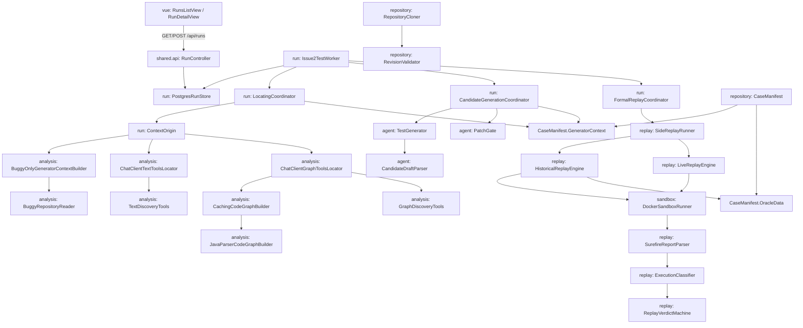

# 架构图与图元对照

本图描述**当前代码**里的 Issue2Test 主链、Oracle 隔离和四种 `ContextOrigin`，不是目标架构。每个图元在下表都有包或类。

图工具循环在代码里提供 `find` / `expand` / `read` / `submit`。`expand` 是否被模型调用是评测观测，不是本图的能力声明。036、5b 与 Spring 案例研究三次观测均为 0 次。

Oracle 隔离：`agent` 包不依赖 `run`，也拿不到 `CaseManifest.OracleData`（Fixed Revision、已知触发测试）。定位与生成只看见 Generator Context 与 Buggy Revision 上的源码快照。Fixed Revision 只进入 `HistoricalReplayEngine` 一侧。

`PINNED` 是预置快照透传，不是评测三臂之一。评测三臂是 `HEURISTIC`、`TEXT_TOOLS`、`GRAPH_TOOLS`。

## 图元 → 包 / 类

| 图元 | 包 / 类 | 代码职责 |
| --- | --- | --- |
| vue | `frontend/src/views/RunsListView.vue` | 只读 Run 列表；详情页为 `RunDetailView.vue` |
| api | `io.github.patchatlas.shared.api.RunController` | `POST/GET /api/runs`，异步创建，不在 HTTP 里等模型或 Docker |
| store | `io.github.patchatlas.run.PostgresRunStore` | Verification Run 持久化、租约、claim |
| worker | `io.github.patchatlas.run.Issue2TestWorker` | 按 `LOCATING` / `GENERATING` / `REPLAYING` 分发给三个编排器 |
| locating | `io.github.patchatlas.run.LocatingCoordinator` | 定位阶段；不持有 Store，写入只经 `LocatingRunSession` |
| origin | `io.github.patchatlas.run.ContextOrigin` | `PINNED` / `HEURISTIC` / `TEXT_TOOLS` / `GRAPH_TOOLS` |
| heuristic | `io.github.patchatlas.analysis.BuggyOnlyGeneratorContextBuilder` | 启发式选文件：Issue 类名与引用测试 |
| textLoop | `io.github.patchatlas.analysis.ChatClientTextToolsLocator` | 文本工具循环 |
| graphLoop | `io.github.patchatlas.analysis.ChatClientGraphToolsLocator` | 图工具循环 |
| graphBuild | `io.github.patchatlas.analysis.CachingCodeGraphBuilder` | 构建并缓存代码图 |
| javaGraph | `io.github.patchatlas.analysis.JavaParserCodeGraphBuilder` | JavaParser 构图 |
| graphTools | `io.github.patchatlas.analysis.GraphDiscoveryTools` | 图发现工具 `find` / `expand` |
| textTools | `io.github.patchatlas.analysis.TextDiscoveryTools` | 文本发现工具 `search` / `list` |
| buggyRead | `io.github.patchatlas.analysis.BuggyRepositoryReader` | 只读 Buggy Revision 工作区 |
| genCoord | `io.github.patchatlas.run.CandidateGenerationCoordinator` | 生成、预热、Gate、Buggy 预验证 |
| generator | `io.github.patchatlas.agent.TestGenerator` | 生成器接口；生产装配 `SpringAiTestGenerator` 或 `FakeTestGenerator` |
| gate | `io.github.patchatlas.agent.PatchGate` | Candidate Test Patch 硬校验 |
| parser | `io.github.patchatlas.agent.CandidateDraftParser` | 从模型输出解析候选草稿 |
| formal | `io.github.patchatlas.run.FormalReplayCoordinator` | 工作区重建、再次 Gate、正式双侧 Replay |
| sides | `io.github.patchatlas.replay.SideReplayRunner` | 单侧执行，不隐式改网络模式 |
| hist | `io.github.patchatlas.replay.HistoricalReplayEngine` | 有 Fixed Revision 时的历史裁决 |
| live | `io.github.patchatlas.replay.LiveReplayEngine` | 无 Fixed Revision 时只能到 `REPRODUCTION_CANDIDATE` |
| sandbox | `io.github.patchatlas.sandbox.DockerSandboxRunner` | 受限 Docker 内跑强类型 Maven 命令 |
| surefire | `io.github.patchatlas.replay.SurefireReportParser` | 解析 Surefire XML |
| classify | `io.github.patchatlas.replay.ExecutionClassifier` | 把执行事实归入失败类别 |
| verdict | `io.github.patchatlas.replay.ReplayVerdictMachine` | 机械产出 `ReplayVerdict` |
| manifest | `io.github.patchatlas.repository.CaseManifest` | 类型层拆开 Generator Context 与 Oracle Data |
| genCtx | `io.github.patchatlas.repository.CaseManifest.GeneratorContext` | 生成器可见字段，不含 Fixed Revision |
| oracle | `io.github.patchatlas.repository.CaseManifest.OracleData` | Fixed Revision 与已知触发测试 |
| cloner | `io.github.patchatlas.repository.RepositoryCloner` | 公开 HTTPS 仓库获取 |
| locRepo | `io.github.patchatlas.repository.RevisionValidator` | 固定 Commit 校验 |

相关装配：`io.github.patchatlas.run.RunWorkerConfiguration` 在 `patchatlas.worker.enabled=true` 时接上 Worker 与 Docker 沙箱。一条命令启动路径不启用该配置。
